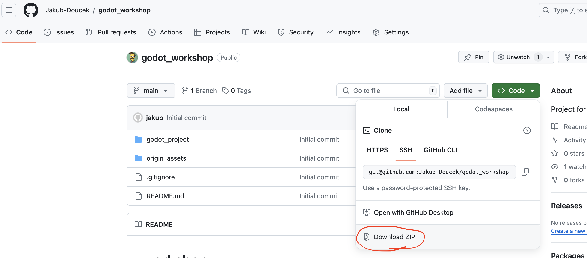

# Godot Workshop

## Prerequisites

 1. Download Godot version 4.2.2 (basic version without C#). 
https://godotengine.org/download/archive/4.3-stable

2. Download or clone this Repo.

## Theoretical structure of workshop

 - Create a scene
 - Add image - platform - Sprite2D
 - Window settings https://docs.godotengine.org/en/stable/tutorials/rendering/multiple_resolutions.html
 - Add character - AssetLib - https://github.com/Ev01/PlatformerController2D - CharacterBody2D
 - CharacterBody2D
 	- Add image - Sprite2D
 	- Add CollisionShape
    - Add script + plugin downloaded script
      - Set inputs
 - Add collision platform to StaticBody2D + CollisionShape2D 
 - Create a scene from Node
 - Tilemap
    - Create and set up a Tileset - physics layer - make a few collisions
 - Character animation - AnimatedSprite2D
 	- directional rotation script
 	
In case there will be enough time:
  - Particle effect 
 - Sound
   - trigger by key - script
- UI - task completion
 - Collision with Area2D
 - Signal
 - Moving platform
   -  AnimationPlatform
   - Tooling in editor
   - Scripting
